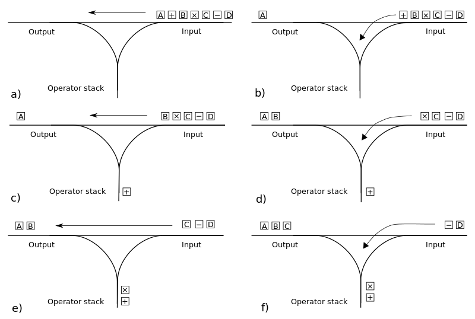
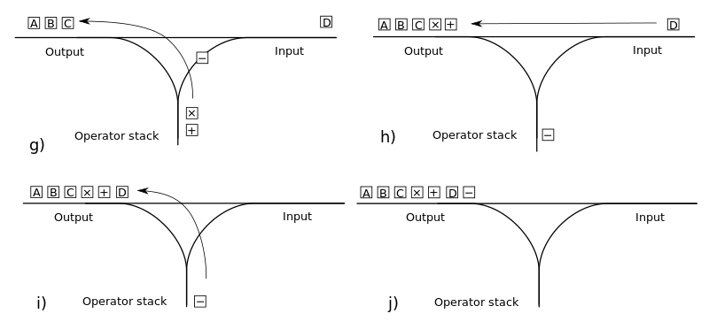

title: Regular Expressions in Go
output: index.html
controls: true

--

# REGEXS AND MATCHING STRINGS
## Ben Creighton

--

### The Problem

#### &lt;R, w&gt; | R is a regex that generates w

Very old problem.

Many possible approaches.

Many more implementations.

--

### My Approach

Why reinvent the wheel?

Regex → Postfix Notation → NFA → Simulate NFA

Based on Thomson's NFA algorithm and Russ Cox's implementation.

Also used Dijkstra's shunting-yard algorithm for creating postfix notation.

Used Go.

--
### Regex → Postfix

a(bb)+a == abb.+.a.

Dijkstra's shunting-yard algorithm to convert to RPN.

Makes constructing NFA much easier.


--
### Regex → Postfix

--
### Regex → Postfix

###### By Salix alba (Own work) CC BY-SA 3.0, via Wikimedia Commons
--
### Postfix Notation → NFA

Graph(ish) structure, made up of State objects.

Postfix regex is parsed and each State is built based on the character read.

Stack of Fragments built into full NFA
--
### Postfix Notation → NFA
## Data structures
State
```go
type State struct {
    char     byte // Char to read for out transition
    stype    int // Accept, split, or one
    out      *State // Out arrow
    out1     *State // Other out arrow
    lastlist int // used for execution
}
```
Fragment
```go
type Frag struct {
    start *State
    out   OutList
}
type OutList []**State
```
--
### Postfix Notation → NFA

## Literal characters

```go
default:
    s = &State{char: byte(c)}
    stack.push(Frag{s, oneOut(&s.out)})
```

## Concatenation

```go
case '.':
    frag2 = stack.pop()
    frag1 = stack.pop()
    frag1.out.patch(frag2.start)
    stack.push(Frag{frag1.start, frag2.out})
```

## Alternation / Or

```go
case '|':
    frag2 = stack.pop()
    frag1 = stack.pop()
    s = &State{stype: SPLIT, out: frag1.start, out1: frag2.start}
    stack.push(Frag{s, append(frag1.out, frag2.out...)})
```
--
### Postfix Notation → NFA

## Zero or one

```go
case '?':
    frag1 = stack.pop()
    s = &State{stype: SPLIT, out: frag1.start}
    stack.push(Frag{s, append(frag1.out, oneOut(&s.out)...)})
```

## Zero or more

```go
case '*':
    frag1 = stack.pop()
    s = &State{stype: SPLIT, out: frag1.start}
    frag1.out.patch(s)
    stack.push(Frag{s, oneOut(&s.out1)})
```

## One or more

```go
case '+':
    frag1 = stack.pop()
    s = &State{stype: SPLIT, out: frag1.start}
    frag1.out.patch(s)
    stack.push(Frag{frag1.start, oneOut(&s.out1)})
```
--
### Simulate NFA
Keep two lists of states: states currently in, and states that will be transitioned to in the next step of execution.

1. For every character read in the regex:
<!--  1. Check if any state in the current list is an accept state. -->
 1. Create list of every new state that can be transitioned to.
 2. Make the list of new states the list of current states.
 3. Repeat.
2. If any states in the final list of states is the accept state, return true.
--
### Demo!
https://play.golang.org/p/JMkw-zeCYI
--
# Questions?